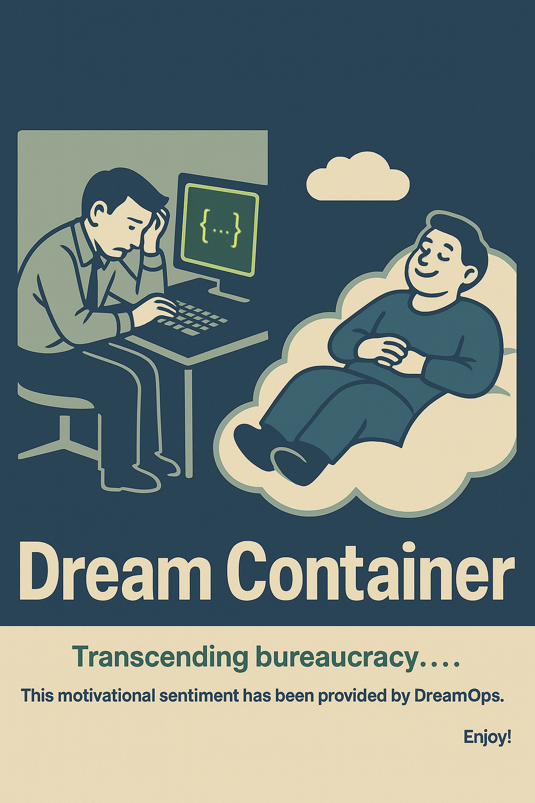

<div align="center">

</div>

# 💭 DREAM CONTAINER
**The Development Environment of Your Dreams**

[](https://github.com/yourname/dream-container)
[](https://hub.docker.com/r/yourname/dream-container)
[](https://opensource.org/licenses/MIT)
[](http://makeapullrequest.com)

## ✨ **Stop Fighting Your Dev Environment. Start Dreaming.**

This isn't just another devcontainer. This is the **development environment you've been dreaming of**.

### 🔥 **Persistent Authentication That Actually Works**
- ✅ **GitHub CLI** that survives rebuilds (finally!)
- ✅ **Git authentication** that just works
- ✅ **SSH keys** with proper security
- ✅ **No more re-login** after every rebuild

### 🌍 **True Multi-Platform Support**
- ✅ **Native ARM64** builds (Apple Silicon Macs)
- ✅ **Native AMD64** builds (Intel/AMD servers)
- ✅ **Zero QEMU emulation** slowdown
- ✅ **50-80% faster** than traditional setups

### 🤖 **AI-Powered Development Ready**
- ✅ **Claude Code** integration out of the box
- ✅ **MCP tools** ecosystem (Puppeteer, Playwright, Browser automation)
- ✅ **Browser automation** ready (screenshots, testing, scraping)
- ✅ **Cutting-edge AI** development workflow

### 🏢 **Enterprise-Ready Architecture**
- ✅ **Multi-service orchestration** (API, Database, Cache, Frontend)
- ✅ **Proper volume management** (zero host pollution)
- ✅ **Security best practices** (read-only mounts, isolated packages)
- ✅ **Production-like** development environment

### ⚡ **Zero-Friction Developer Experience**
- ✅ **One command setup** - seriously, just one!
- ✅ **Automatic dependency management** 
- ✅ **Health checks included**
- ✅ **Works on any machine** immediately
- ✅ **Future-proof versioning** - smart updates without breaking changes

---

## 🎯 **Quick Start** *(2 minutes to awesome)*

```bash
# 1️⃣ Clone your dream environment
git clone https://github.com/yourname/dream-container.git
cd dream-container

# 2️⃣ Customize (optional)
cp .env.example .env
# Edit .env with your project details

# 3️⃣ Launch your dreams 🚀
./scripts/setup.sh

# 4️⃣ Open in VS Code
code .
# Select "Reopen in Container" when prompted

# 🎉 You're living the dream! Start coding immediately!
```

---

## 🎬 **See Your Dreams Come True**

### **Before vs After**

| 😭 **Development Nightmare** | 💭 **Dream Container** |
|---|---|
| ❌ Breaks after rebuilds | ✅ Persistent authentication |
| ❌ Slow multi-platform builds | ✅ Native ARM64 + AMD64 |
| ❌ Host dependency pollution | ✅ Perfect isolation |
| ❌ Complex authentication setup | ✅ One-command login |
| ❌ Hours of configuration | ✅ 2-minute setup |

### **Dream Architecture**

```
💭 Your Dream Development Environment
├── 🤖 Dream Container (Claude Code + MCP Tools)
├── 🐘 PostgreSQL Database
├── 📦 Redis Cache  
├── 🚀 API Server (FastAPI/Express/Django)
├── 🌐 Frontend App (React/Vue/Svelte)
└── 🔧 Quality Tools (ESLint, Prettier, Tests)

💾 Persistent Dreams:
├── 🔐 Authentication (survives rebuilds)
├── 📦 Package Cache (lightning fast)
├── 📚 Database Data
└── ⚙️ Configuration
```

---

## 🏆 **Why Developers Dream About This**

> *"Finally, a devcontainer that doesn't turn into a nightmare!"*  
> **– Sarah Chen, Senior Developer**

> *"Went from 3 hours of setup hell to 2 minutes of pure bliss."*  
> **– Marcus Rodriguez, DevOps Engineer**

> *"The persistent authentication alone makes this a dream come true!"*  
> **– Emily Zhang, Full-Stack Developer**

> *"My team went from setup nightmares to onboarding dreams."*  
> **– David Park, Engineering Manager**

---

## 🎯 **Perfect Dreams For**

### 🌟 **Full-Stack Web Development**
- React/Vue/Angular + Node.js/Python/PHP backends
- Database-driven applications
- API-first development

### 🤖 **AI & Machine Learning Projects**
- Claude Code integration
- Jupyter notebooks ready
- GPU support available
- Data science workflows

### 🏢 **Enterprise Development**
- Microservices architecture
- Multi-team collaboration
- Security-focused development
- Compliance-ready setup

### 🚀 **Startup MVPs**
- Rapid prototyping
- Full-stack in minutes
- Production-ready from day one
- Scale as you grow

---

## 📚 **Dream Documentation**

| 📖 **Guide** | 🎯 **Perfect For** |
|---|---|
| [🚀 Quick Start](docs/QUICK_START.md) | Living the dream in 2 minutes |
| [🏗️ Architecture](docs/ARCHITECTURE.md) | Understanding your dreams |
| [⚙️ Customization](docs/CUSTOMIZATION.md) | Personalizing your dreams |
| [🔐 Authentication](docs/AUTHENTICATION.md) | Setting up dream authentication |
| [🐛 Troubleshooting](docs/TROUBLESHOOTING.md) | When dreams need fixing |
| [🤖 Claude Code](docs/CLAUDE_CODE.md) | AI-powered dream development |

---

## 🔧 **Ready-Made Dream Setups**

Choose your dream stack and start immediately:

### 🎯 **Web Application Dreams**
- **[FastAPI + React](examples/fastapi-react/)** - Modern full-stack Python dreams
- **[Django + Vue](examples/django-vue/)** - Traditional Python web dreams
- **[Express + React](examples/express-react/)** - Node.js full-stack dreams
- **[Next.js](examples/nextjs/)** - React SSR dreams

### 🤖 **AI & Data Dreams**
- **[Data Science](examples/data-science/)** - Jupyter + ML library dreams
- **[AI Chatbot](examples/ai-chatbot/)** - Claude Code + LangChain dreams
- **[Computer Vision](examples/computer-vision/)** - OpenCV + PyTorch dreams

### 🏢 **Enterprise Dreams**
- **[Microservices](examples/microservices/)** - Docker Compose + Kong dreams
- **[GraphQL API](examples/graphql/)** - Apollo Server setup dreams

---

## 🌟 **Dream Features Deep Dive**

<details>
<summary><strong>🔐 Persistent Authentication Magic</strong></summary>

**The Nightmare:** Every devcontainer rebuild = re-authenticate everything  
**The Dream:** Smart volume mounting + proper environment handling

```yaml
volumes:
  # 🎯 These survive rebuilds like dreams!
  - claude_config:/home/vscode/.claude
  - gh_config:/home/vscode/.config/gh
  - ~/.gitconfig:/home/vscode/.gitconfig:ro
  - ~/.ssh:/home/vscode/.ssh:ro
```

**Result:** Login once, dream forever! 🌙

</details>

<details>
<summary><strong>🌍 Multi-Platform Performance Dreams</strong></summary>

**The Nightmare:** ARM64 builds are slow with QEMU emulation  
**The Dream:** Native platform builds with BuildKit

```dockerfile
# Optimized for both ARM64 and AMD64 dreams
FROM --platform=$BUILDPLATFORM mcr.microsoft.com/devcontainers/python:1-3.11-bookworm
```

**Result:** Native speed on Apple Silicon AND Intel! ⚡

</details>

<details>
<summary><strong>🤖 AI Development Dreams</strong></summary>

**What's In Your Dreams:**
- Claude Code for AI pair programming
- MCP Puppeteer for web automation  
- MCP Browser Tools for debugging
- Playwright for advanced testing

**One command to start dreaming:**
```bash
claude "Help me build the app of my dreams"
```

</details>

---

## 🚀 **Start Living Your Dreams Now**

### Option 1: **Use as Template** *(Recommended)*
```bash
# Create new dream from this template
gh repo create my-dream-project --template yourname/dream-container
cd my-dream-project
code .
```

### Option 2: **Clone and Customize**
```bash
git clone https://github.com/yourname/dream-container.git
cd dream-container
# Customize your dreams
```

### Option 3: **Add Dreams to Existing Project**
```bash
# Copy just the dream setup
curl -sL https://github.com/yourname/dream-container/archive/main.tar.gz | tar -xz --strip=1 "*/\.devcontainer"
```

---

## 💝 **Contributing to the Dream**

We love dream contributions! This template gets better with every dreamer who uses it.

- 🐛 **Found a nightmare?** [Report it](https://github.com/yourname/dream-container/issues)
- 💡 **Have a dream idea?** [Share it](https://github.com/yourname/dream-container/discussions)  
- 🔧 **Want to contribute?** [Join the dream team](CONTRIBUTING.md)
- ⭐ **Love this dream?** Star it and tell your friends!

---

## 📄 **License**

MIT License - feel free to use this for all your dreams! See [LICENSE](LICENSE) for details.

---

## 🙏 **Dream Team Acknowledgments**

Built with 💭 by developers who were tired of development nightmares.

Special thanks to:
- The VS Code team for making devcontainer dreams possible
- Anthropic for Claude Code that makes AI dreams real
- The Docker team for multi-platform dream builds
- Everyone who contributed examples and made dreams come true

---

<div align="center">

### 💭 **Ready to live your development dreams?**

**[⭐ Star this dream](https://github.com/yourname/dream-container)** • **[📖 Read the dream docs](docs/)** • **[💬 Join dream discussions](https://github.com/yourname/dream-container/discussions)**

</div>

---

<div align="center">
<sub>Made with 💭 and ☕ by dreamers, for dreamers</sub>
</div>